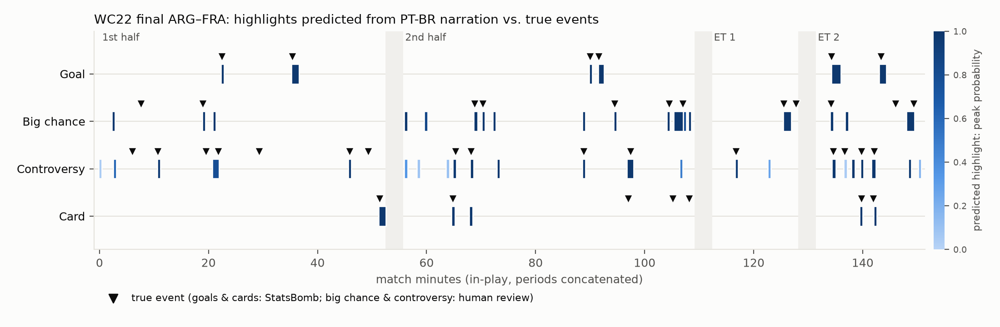
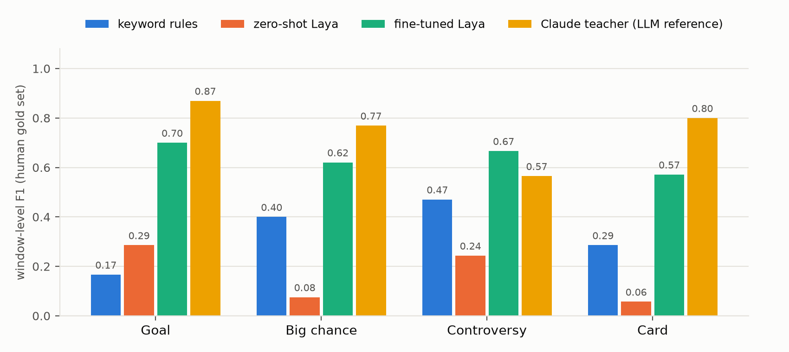
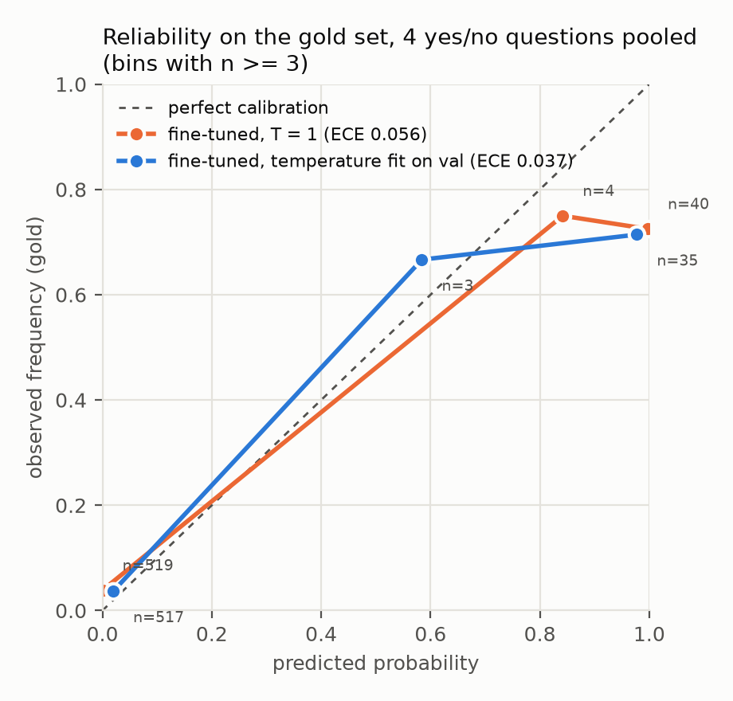

# lance-a-laya

**Real-time football highlights from Brazilian Portuguese (PT-BR) narration, with a fine-tuned
[Laya](https://github.com/NandhaKishorM/laya) decision model.**

The pipeline:

1. Listens to the TV or radio narration of a match and transcribes it.
2. Every 5 seconds, asks a fine-tuned `laya-multilingual` five questions about the last 20 seconds, in one
   forward pass: *goal? big chance? controversy? card? how intense?*
3. Turns confident answers into a timestamped highlight timeline and clips.

Everything was measured on a held-out match, the 2022 World Cup final, with labels written by a human.

## Results: 2022 World Cup final (held out), human-labeled

The final was never looked at during development. One person labeled 150 windows blind; 9 were marked
unsure and excluded. The same person then reviewed every big-chance and controversy trigger proposed by any
method (89 candidates).

**Where it won:**

- **Goals.** Fine-tuned Laya caught **all 6 goals with zero false alarms**, flagging 7 minutes of play.
  Keyword rules found 3 of 6 and raised 17 alerts, because "gol" is everywhere in PT-BR narration.
- **Every question vs. both baselines.** Fine-tuned beats keywords and zero-shot Laya on all five questions
  at window level.
  - It wins most clearly where keywords struggle: goal F1 0.70 vs 0.17 (AP 0.93 vs 0.27), controversy AP
    0.78 vs 0.43, and intensity accuracy 0.72 vs 0.38.
- **It beat its own teacher on controversy.** Window F1 0.67 vs 0.57 for the Claude labels it was trained
  on, and event recall 12/16 vs 9/16. Training used only the spans the teacher was *sure* about.
- **Fast enough for real time.** All 5 questions in one forward pass: **32 ms per window on a T4**, and
  262 ms end-to-end from a laptop in Brazil to a Modal GPU and back, against a 5 s budget per window.

**Where it didn't:**

- **The Claude teacher still has the higher window F1** on goal, big chance, card and intensity. By
  threshold-free AP, fine-tuned Laya is ahead on goal (0.93 vs 0.85) and card (0.64 vs 0.52).
- **Cards tie with keywords at event level** (4/7 caught, 4/5 precision for both). Narrators say "cartão
  amarelo" literally, so keywords are strong here.
- **Quiet referee disputes are missed.** It catches VAR checks and "é pênalti!", but not a muttered "não
  foi falta?".
- **Threshold brittleness.** Several misses sit 0.001–0.006 below a threshold chosen on validation; see
  *Findings*.
- **Zero-shot Laya is not usable here.** It beats the keyword rules only on goal and intensity, and is far
  below them on big chance, controversy and card.







**Window level, human gold set** (141 windows of the test match; 9 marked unsure are excluded). F1 at thresholds chosen on validation, with threshold-free average precision (AP) in parentheses.

| method | goal | big chance | controversy | card | intensity acc. (MAE) |
|---|---|---|---|---|---|
| Keyword rules | 0.17 (0.27) | 0.40 (0.59) | 0.47 (0.43) | 0.29 (0.40) | 0.38 (0.87) |
| Zero-shot Laya | 0.29 (0.31) | 0.08 (0.10) | 0.24 (0.26) | 0.06 (0.08) | 0.42 (0.76) |
| **Fine-tuned Laya** | 0.70 (0.93) | 0.62 (0.66) | 0.67 (0.78) | 0.57 (0.64) | 0.72 (0.30) |
| *Claude teacher (LLM reference)* | 0.87 (0.85) | 0.77 (0.84) | 0.57 (0.46) | 0.80 (0.52) | 0.79 (0.21) |

Gold positives: goal 12, big chance 16, controversy 20, card 4.

**Event level, whole test match.** Positive windows merge into triggers; an event is caught if a trigger lies within its tolerance (goal ±30 s, card −10 s…+120 s after the foul, big chance and controversy ±30 s of a human-confirmed moment). A highlight lasts at most 2 min. Cells: recall (caught / events) · precision (true triggers / triggers) · total flagged time (in-play match ≈ 142 min). Triggers that only match a moment the reviewer marked unsure are left out.

| method | goal | big chance | controversy | card |
|---|---|---|---|---|
| Keyword rules | 3/6 · 3/17 · 12 min | 5/12 · 5/7 · 5 min | 11/16 · 11/18 · 13 min | 4/7 · 4/5 · 4 min |
| Zero-shot Laya | 5/6 · 5/33 · 16 min | 12/12 · 16/67 · 108 min | 16/16 · 26/75 · 162 min | 7/7 · 11/71 · 84 min |
| **Fine-tuned Laya** | 6/6 · 6/6 · 7 min | 9/12 · 10/14 · 12 min | 12/16 · 12/20 · 12 min | 4/7 · 4/5 · 4 min |
| *Claude teacher (LLM reference)* | 6/6 · 6/6 · 7 min | 9/12 · 9/10 · 11 min | 9/16 · 9/14 · 15 min | 5/7 · 5/5 · 4 min |

**Calibration of the fine-tuned model on the gold set** (4 yes/no questions pooled, 10 bins): ECE 0.037 with temperatures fitted on validation vs 0.056 at T = 1.

**Latency** (fine-tuned, all 5 questions in one forward pass per window):

| GPU | p50 / p90 per window (batch 1) | batched throughput |
|---|---|---|
| Tesla T4 | 31.6 / 34.4 ms | 46.2 windows/s |
| NVIDIA L4 | 37.8 / 39.5 ms | 58.7 windows/s |

End-to-end in the streaming demo (this Mac in Brazil -> deployed Modal T4 -> back, 1698 sequential windows): p50 262 ms, p90 300 ms, against a 5 s budget per window.

**Notes on the evaluation:**

- **Thresholds.** All thresholds come from the validation matches (keyword thresholds from train + val).
  Post-hoc, *not* used in the tables: with a goal threshold of 0.97 instead of 0.981, goal F1 would be 0.83.
- **Two-minute highlight cap.** Added after the first evaluation run. Without it, zero-shot fired on nearly
  every window and its positives merged into match-long "highlights" that technically contained every event
  (16/16 controversy recall at 4/4 precision while flagging 142 of 142 minutes). The cap barely changes the
  other methods.
- **Teacher row.** It uses the Claude subagent spans alone, without event data, with uncertain spans counted
  as positive.
- **Small numbers.** Card has only 4 window-level gold positives, so treat that column as anecdotal.
- **Error analysis:** [`outputs/error_analysis.md`](outputs/error_analysis.md).

### Labeling decisions (human gold set and review)

- **Goal:** the live call of the goal and its immediate celebration. Praise or recap in a later window is
  not a goal.
  - A goal ruled out by VAR is controversy, not goal.
  - When a goal is confirmed after a review, the confirmation window is controversy.
- **Big chance:** a clear chance that did not go in.
  - A penalty saved or missed is a big chance; a penalty scored is a goal.
  - **A chance followed by a late offside flag counts as a big chance.** Assistants keep the flag down until
    the attack ends.
- **Controversy:** a decision or non-decision that is genuinely contested or reviewed. VAR does not need to
  be involved.
  - "É pênalti!" with protests or a debate counts. A passing remark does not.
- **Card:** the window where the card is shown or announced, not the foul.
- **Intensity:** the highest level reached in the window.


## How it works

```
YouTube VOD (CazéTV / radio)  ──yt-dlp──▶  audio (local, never committed)
        │                                       │
        │                       faster-whisper large-v3 on a Modal L4 (~14× real time)
        ▼                                       ▼
StatsBomb open data ──align (per-period offset)──▶ timestamped transcript
                                                │
                                   20 s windows, 5 s stride
                                                │
            ┌───────────────────────────────────┼─────────────────────────────┐
     event labels (goals, cards,      Claude subagents label spans     human gold set
     high-xG shots, penalties)        from the narration alone         (150 windows of the final)
            └──────────── merged train/val labels ──┘                         │
                                │                                             │
              fine-tune laya-multilingual (official RLCD script, A100, 14 min)│
                                │                                             │
       calibrate on val  ─▶  thresholds on val  ─▶  evaluate  ◀────────────────┘
                                │
           streaming replay ─▶ highlight timeline ─▶ clips (local only)
```

**Data.** 10 full matches with PT-BR narration and timestamped events:

- **Narration:** CazéTV full live VODs of the 2022 World Cup (TV), plus two Copa América 2024 radio
  broadcasts.
- **Events:** [StatsBomb open data](https://github.com/statsbomb/open-data).
- **Split by match:** 7 train, 2 validation (BRA–SUI, ENG–FRA), 1 test (ARG–FRA final).
- **Test-match hygiene:** the final was not inspected during development.

**Schema** (`src/lal/schema.py`, one file used everywhere). Four Laya `noul` questions with explicit
true/false criteria (`goal`, `big_chance`, `controversy`, `card`), plus a 3-level `score` for intensity.
English instructions beat Portuguese ones zero-shot on validation.

**Labels.** Positive window counts for train / val:

| question | train | val |
|---|---|---|
| goal | 126 | 22 |
| big chance | 225 | 59 |
| controversy | 236 | 108 |
| card | 111 | 16 |

- **Goals and cards** come from StatsBomb, aligned to the audio.
- **Big chance, controversy and intensity** come from 10 parallel Claude subagents that read the transcript
  only. Event data and teacher labels agreed on all 34 goals.
- **Uncertain spans** become "ignore" instead of negatives. All disagreements are logged.
- **Gold set:** 150 windows of the final, stratified (teacher/event-positive, keyword-flagged, random) and
  labeled blind by a human in a small local page. A second human pass reviewed every big-chance and
  controversy trigger proposed by any method.

## Findings worth knowing if you build something similar

- **Turn VAD off for sports narration.** With Silero VAD on, faster-whisper dropped 30–50 s around every
  big goal call, because narration shouted over a roaring crowd is classified as non-speech. The no-speech
  skip and `hallucination_silence_threshold` drop the same moments. With all three off, every call came
  back ("Gol… Golaço… É do Brasil") and hallucinations stayed negligible after a small post-filter.
- **Use shots, not only goals, to align match clock to audio.** Goals are unmistakable but sparse; a
  goal-less half once locked onto pre-match talk and was 194 s off. Shots (~25 per match, called as they
  happen) fixed it.
  - Leave-one-out residual: goals median **1.1 s** (p90 5.7 s, 31 goals); shots median 0.7–4.3 s per match.
- **Keywords don't solve "goal" in PT-BR narration.** "Gol" appears constantly ("chutou pro gol", recaps,
  "o gol de ontem"). The keyword rule finds 3 of 6 goals in the final with 3/17 precision.
- **Laya zero-shot is weak; fine-tuning is where the value is**, as Laya's README says. Zero-shot
  controversy ranked worse than random on validation, and the multilingual checkpoint almost never picked
  the first `score` level (issue #131).
- **Watch the probability ceiling.** After calibration (temperature about 4.65), fine-tuned probabilities
  live in [0.018, 0.982], and Laya rounds them to 4 decimals. Thresholds picked on validation therefore
  sit at the ceiling and are brittle: several gold misses scored 0.001–0.006 under the threshold. Report
  AP alongside F1, and pick thresholds with a margin. Details in `outputs/error_analysis.md`.

## Reproduce

Requirements:

- macOS or Linux, Python 3.11, [uv](https://docs.astral.sh/uv/), Node ≥ 22 (for yt-dlp's YouTube
  challenges).
- A [Modal](https://modal.com) account (`uv run modal setup`). The Starter plan's $30/month free credits
  covered the whole project: $6.39 metered in total, including discarded runs, so $0 billed.

```bash
make setup events sources      # env, StatsBomb events, source checks
make audio upload              # low-bitrate audio -> Modal Volume (local copy deleted)
make transcribe pull           # ASR on Modal L4s (~17 min wall clock for 10 matches)
make align windows             # clock->audio offsets + residual report, 20 s / 5 s windows
make teacher-packs             # transcript packs; label them with Claude subagents (guide in schema.py)
make labels                    # merge event + teacher labels, class balance, train/val datasets
make gold-sample gold          # freeze the gold sample, label it at http://127.0.0.1:8765
make zeroshot finetune calibrate predict bench
make review-pool review        # human review of pooled big-chance / controversy triggers
make eval demo plots clips     # results, streaming timeline, figures, local clips
```

**On a new match without event data:** add it to `configs/matches.yaml` (YouTube id and kickoff), deploy
the predictor once (`uv run modal deploy -m lal.cloud.predict`), then run `make new-match MATCH=<id>`. That
runs download → ASR → windows → live streaming through the deployed model. Alignment and labels are only
needed for evaluation.

Tested on the spare BRA–COL radio broadcast:
- **Output:** 72 highlights at about 240 ms per window.
- **Goals:** 1 of 2 caught in play.
- **Caveat:** one false "goal" came from pre-match talk. Without event data the stream includes pre- and
  post-game shows, so automatic kickoff detection is the next fix.

## Limitations

- **One test match, labeled by one person.** 141 scored gold windows, with only **4 card** and 12 goal
  positives, so per-question window F1 has wide error bars. Event-level goal results rest on 6 goals.
- **The teacher is an LLM.** Big chance, controversy and intensity training labels come from Claude
  subagents, and the student partly inherits their judgement. That is why only the human gold set is
  trusted for the headline.
- **Proxies and residual errors.** Card "truth" is the StatsBomb foul time plus a −10…+120 s tolerance,
  because the announcement comes later. Alignment error is about 1–5 s.
- **Scope.** PT-BR only; 2022 World Cup TV narration (one broadcaster) plus two radio matches; ASR errors
  propagate.
- **New matches.** With no event data, the stream isn't trimmed to play: pre- and post-game talk gets
  scored too (one false goal on BRA–COL). Kickoff detection from narration cues is not implemented.
- **Copyright.** Audio, video and transcripts are copyrighted broadcast material and are never committed.
  This repo ships code, configs, StatsBomb-derived events (attribution:
  [StatsBomb open data](https://github.com/statsbomb/open-data)), window IDs with labels, metrics and
  figures. Clips are cut locally for private use only.

## Repo map

| path | what |
|---|---|
| `src/lal/schema.py` | the 5 questions and the labeling guide |
| `src/lal/cloud/` | Modal jobs: `transcribe.py`, `predict.py` (inference, calibration, latency), `finetune.py`, vendored Laya script |
| `src/lal/align.py`, `windows.py` | clock→audio alignment, sliding windows |
| `src/lal/teacher.py`, `build_dataset.py`, `weak_labels.py` | teacher packs, label merging, Laya datasets |
| `src/lal/gold/` | gold sampling, labeling/review page |
| `src/lal/evaluate.py`, `calibrate.py`, `metrics.py`, `report.py` | evaluation and calibration |
| `src/lal/stream_demo.py`, `clips.py`, `plots.py` | demo, clips, figures |
| `outputs/` | `results.json/.md`, figures, `error_analysis.md`, latency, timeline JSON |
